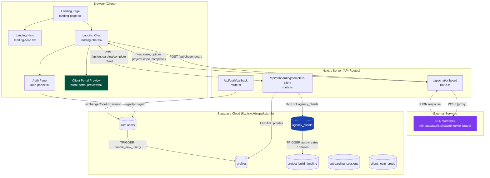
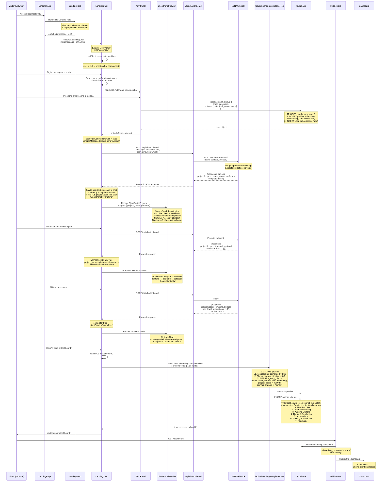
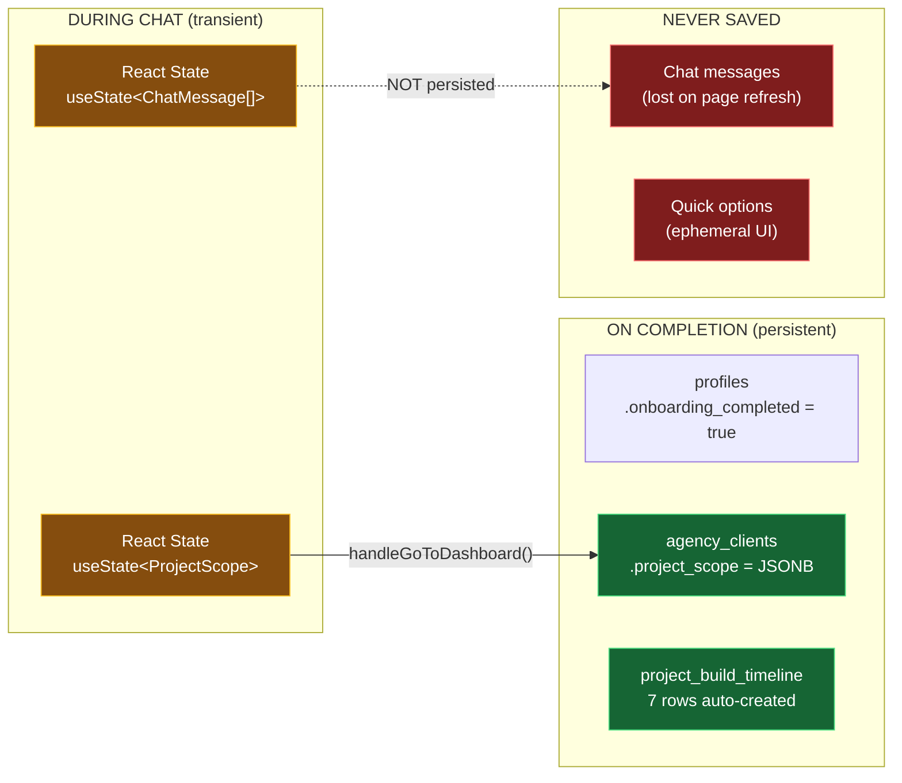
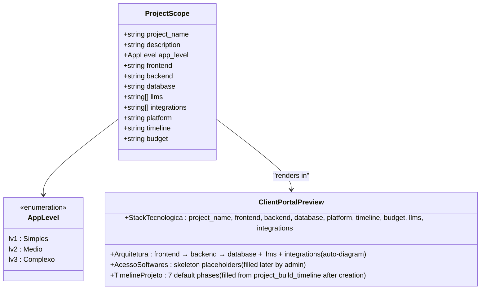
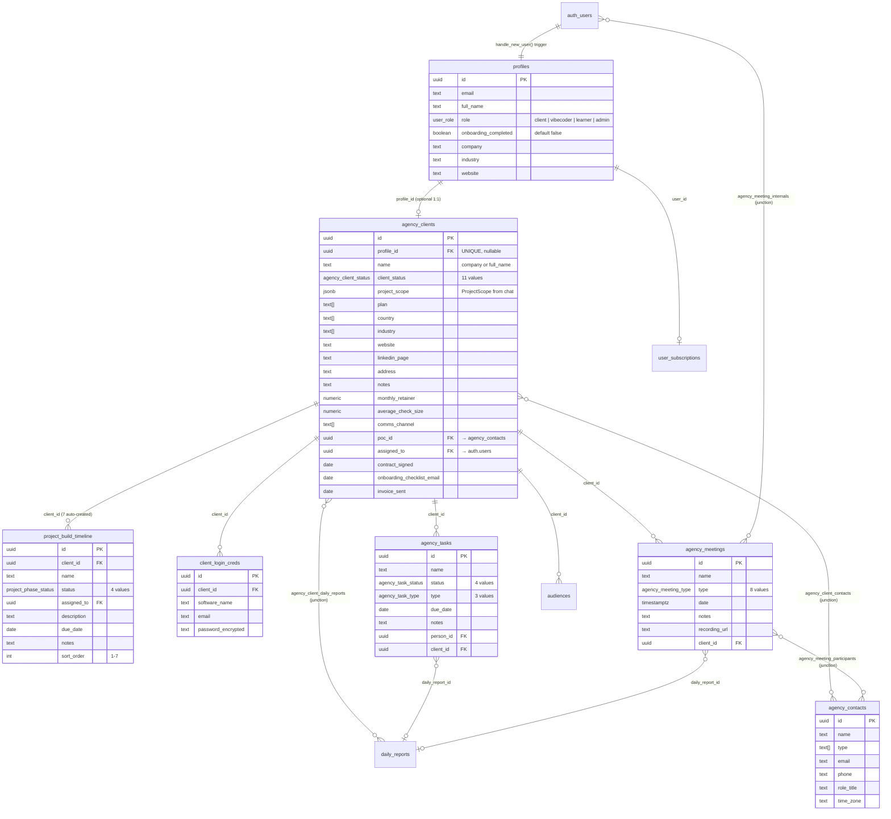
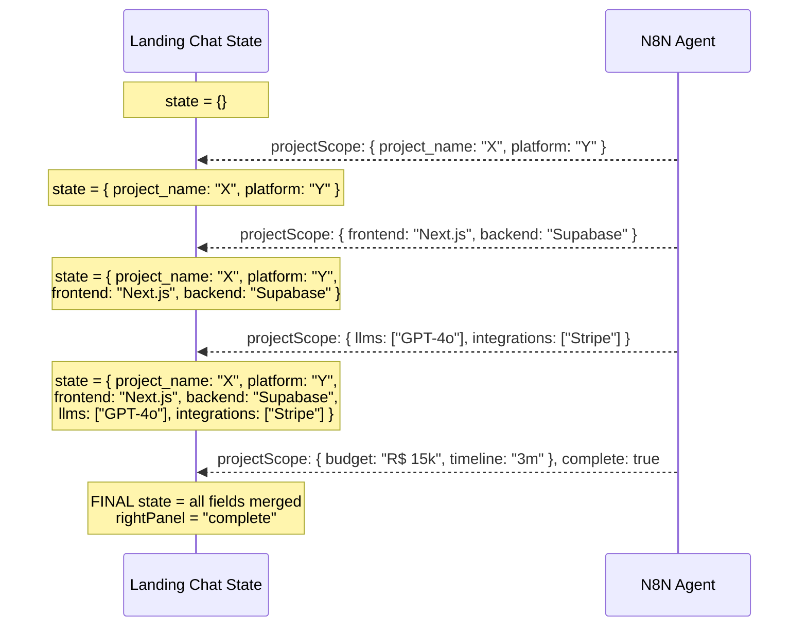
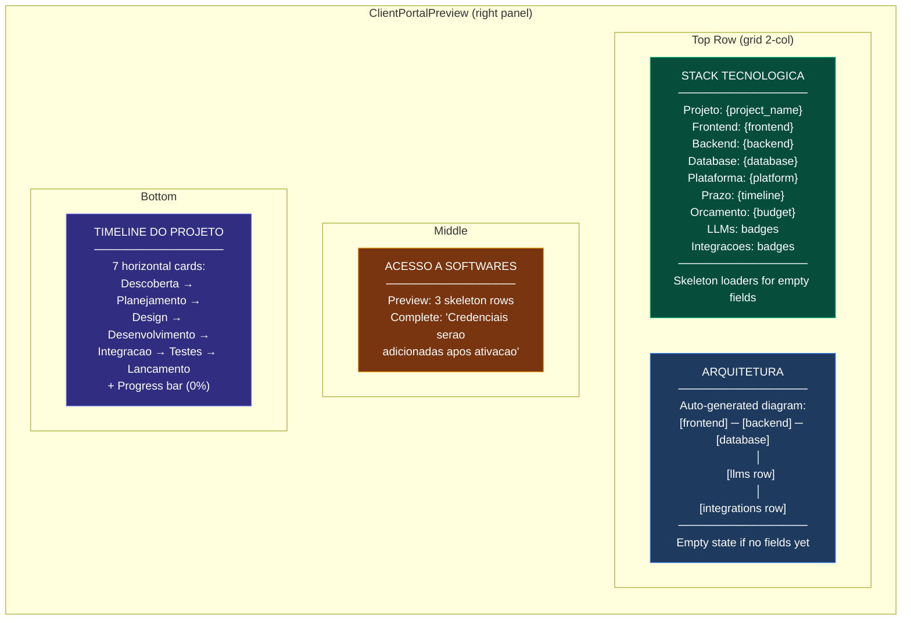
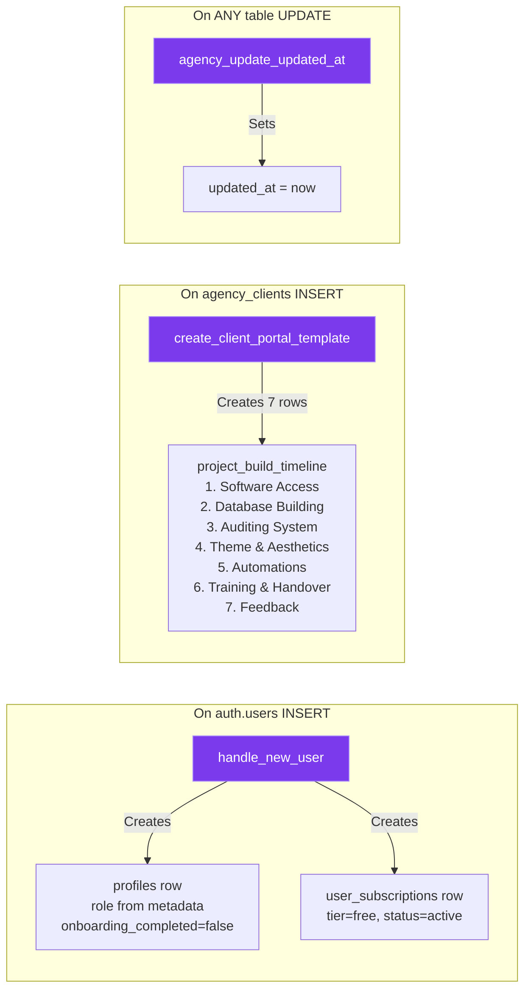
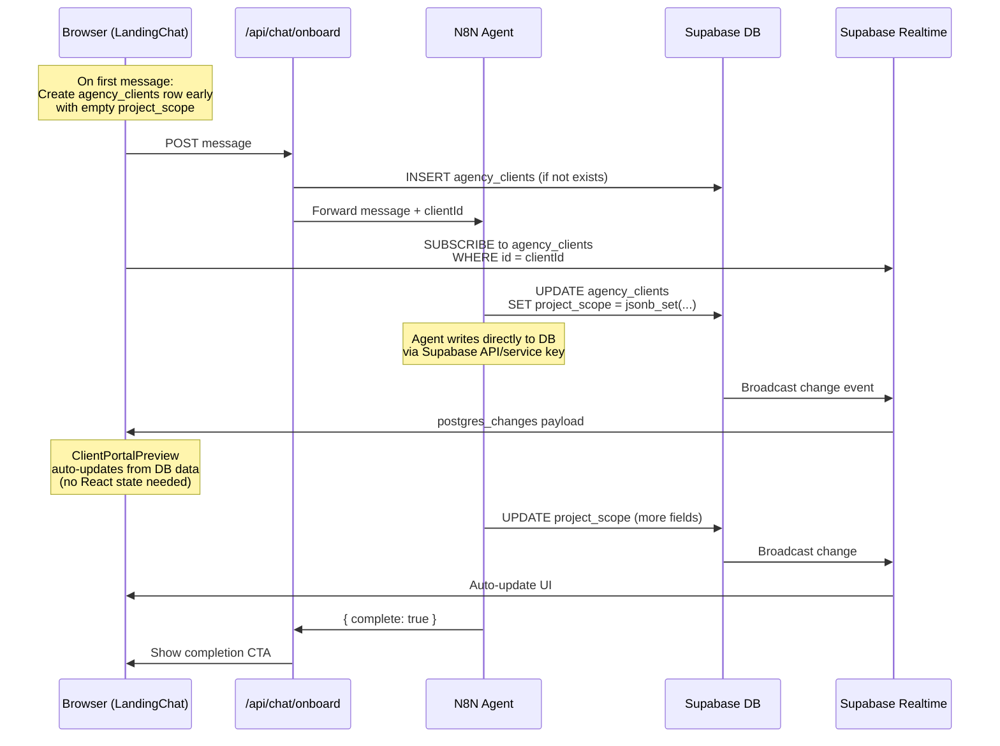

# Automatrix — Onboarding & Client Portal: Data Flow Architecture

> Document generated: 2026-02-15
> Covers: Landing Page chat, N8N integration, database persistence, and Client Portal preview

---

## 1. HIGH-LEVEL ARCHITECTURE



---

## 2. COMPLETE USER JOURNEY (Visitor → Client with Portal)



---

## 3. DATA STORAGE ARCHITECTURE

### 3.1 Where Data Lives at Each Stage



### 3.2 ProjectScope Fields (JSONB on agency_clients)



---

## 4. DATABASE TABLES — COMPLETE RELATIONSHIP MAP



---

## 5. N8N AGENT RESPONSE CONTRACT

The N8N webhook at `https://n8n.automatrix.site/webhook/onboardf` receives and returns:

### Request (from /api/chat/onboard)

```json
{
  "message": "Quero criar um sistema de avaliacoes psicologicas",
  "sessionId": "uuid-v4",
  "role": "client",
  "userName": "Lucas Silva",
  "userEmail": "lucas@automatrix-ia.com"
}
```

### Response (from N8N)

```json
{
  "response": "Texto da resposta do agente para o chat",
  "options": ["Opcao 1", "Opcao 2", "Opcao 3"],
  "projectScope": {
    "project_name": "Automated Assessment System",
    "frontend": "Next.js",
    "backend": "Supabase",
    "database": "PostgreSQL",
    "platform": "automacao",
    "llms": ["GPT-4o", "Claude"],
    "integrations": ["GoHighLevel", "Stripe"],
    "timeline": "3 meses",
    "budget": "R$ 15.000",
    "app_level": "lv2"
  },
  "complete": false
}
```

### Progressive Accumulation



### Merge Logic (landing-chat.tsx:164-171)

```typescript
if (data.projectScope) {
  setProjectScope((prev) => ({
    ...prev,                                    // Keep all existing fields
    ...data.projectScope,                       // Overwrite with new fields
    llms: data.projectScope?.llms ?? prev.llms, // Arrays: only replace if new
    integrations: data.projectScope?.integrations ?? prev.integrations,
  }))
}
```

**Key behavior**: Simple fields are overwritten, arrays (llms, integrations) are only replaced if the agent sends new values — they are NOT merged/appended.

---

## 6. WHAT THE PORTAL PREVIEW SHOWS (CLIENT-PORTAL-PREVIEW.TSX)



---

## 7. RLS (Row Level Security) — WHO CAN DO WHAT

```mermaid
graph TB
    subgraph "Staff (admin / vibecoder)"
        S1[SELECT all agency_clients] --> OK1[✓]
        S2[INSERT agency_clients] --> OK2[✓]
        S3[UPDATE agency_clients] --> OK3[✓]
        S4[DELETE agency_clients] --> OK4[✓]
        S5[CRUD all tables] --> OK5[✓]
    end

    subgraph "Client (role=client)"
        C1[SELECT own agency_client<br/>WHERE profile_id = auth.uid] --> OK6[✓]
        C2[SELECT own tasks<br/>WHERE client_id = my_client_id] --> OK7[✓]
        C3[INSERT/UPDATE/DELETE] --> NO1[✗ Denied]
    end

    subgraph "API Route (service role)"
        A1[/api/onboarding/complete-client<br/>uses server client with<br/>service_role via RLS bypass] --> OK8[✓ Can INSERT]
    end

    style OK1 fill:#166534,color:#fff
    style OK2 fill:#166534,color:#fff
    style OK3 fill:#166534,color:#fff
    style OK4 fill:#166534,color:#fff
    style OK5 fill:#166534,color:#fff
    style OK6 fill:#166534,color:#fff
    style OK7 fill:#166534,color:#fff
    style OK8 fill:#166534,color:#fff
    style NO1 fill:#7f1d1d,color:#fff
```

**Note**: The `createClient()` from `@/lib/supabase/server.ts` uses the user's session cookies, so it respects RLS. The `/api/onboarding/complete-client` route runs as the authenticated user (client), but the RLS policy `staff_full_access` only allows staff. **This means the client INSERT will fail under current RLS.**

**Fix needed**: Either add an RLS policy allowing `INSERT` for clients on their own row, or use a service-role client for this operation.

---

## 8. TRIGGERS — AUTOMATED DATABASE ACTIONS



---

## 9. CURRENT LIMITATIONS & GAPS

| # | Issue | Impact | Fix |
|---|-------|--------|-----|
| 1 | **No progressive save** — projectScope only saved on completion | Data lost if user closes tab during chat | Save to `onboarding_sessions.project_scope` after each N8N response |
| 2 | **No Supabase Realtime** — portal preview reads from React state only | If agent writes to DB directly, UI won't update | Add `supabase.channel().on('postgres_changes')` subscription |
| 3 | **Chat messages not persisted** — only in React state | Can't resume conversation after page refresh | Save to `onboarding_sessions.conversation` progressively |
| 4 | **RLS blocks client INSERT on agency_clients** | `/api/onboarding/complete-client` may fail if using user session | Add INSERT policy for own profile_id, or use service-role client |
| 5 | **N8N must return exact JSON format** — no validation | If N8N returns wrong format, fields silently ignored | Add Zod validation on API route response |
| 6 | **client_login_creds / project_build_timeline** — only admin can fill | Client portal shows empty until admin populates | Consider CRUD UI for admin in client detail page |
| 7 | **No offline/error recovery** — if N8N is down, chat breaks | User sees "Agente indisponivel" error | Add retry logic or fallback static questionnaire |

---

## 10. PROPOSED REALTIME ARCHITECTURE (Future)



In this model:
1. **N8N writes directly** to `agency_clients.project_scope` via Supabase REST API (using service key)
2. **Browser subscribes** to changes on the `agency_clients` row
3. **UI updates automatically** when the JSONB column changes
4. **No React state** needed for projectScope — it's always from the DB
5. **Survives page refresh** — data is in DB, just resubscribe

---

## 11. FILE REFERENCE

| File | Role |
|------|------|
| `src/app/landing-page.tsx` | Router: landing vs chat view |
| `src/app/landing-hero.tsx` | Hero with role cards + first message input |
| `src/app/landing-chat.tsx` | Main chat component + right panel orchestrator |
| `src/app/auth-panel.tsx` | Inline auth (register/login) in chat flow |
| `src/app/client-portal-preview.tsx` | Right panel: 4-section portal preview |
| `src/app/project-scope-card.tsx` | Old component (replaced by client-portal-preview) |
| `src/app/api/chat/onboard/route.ts` | Proxy: Next.js → N8N webhook |
| `src/app/api/onboarding/complete-client/route.ts` | Marks complete + creates agency_client |
| `src/app/(onboarding)/onboarding/actions.ts` | Server actions for /onboarding page flow |
| `src/app/(onboarding)/onboarding/client-onboarding.tsx` | Alternative onboarding (form + AI chat) |
| `src/lib/supabase/middleware.ts` | Onboarding gate + auth redirect |
| `src/types/index.ts` | ProjectScope interface + all enums |
| `supabase/migrations/20260214120000_agency_os_schema.sql` | Agency OS tables, triggers, RLS |
